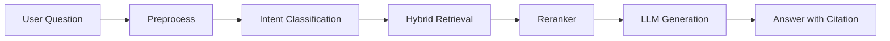

# Đánh giá Chatbot RAG - CTU Student Service

File này dùng để theo dõi cách **đánh giá chất lượng chatbot**, bao gồm độ đúng nội dung, khả năng truy xuất tài liệu, citation, checklist thủ tục và mức độ an toàn khi trả lời sinh viên.

---

## 1. Mục tiêu đánh giá

Chatbot cần đạt các mục tiêu:

- Trả lời đúng theo tài liệu CTU đã được duyệt.
- Không bịa thông tin ngoài nguồn.
- Có citation rõ ràng theo tài liệu, trang, phiên bản.
- Tìm đúng thủ tục hoặc quy định liên quan.
- Tạo checklist giấy tờ dễ làm theo.
- Biết nói “chưa có thông tin trong tài liệu” khi thiếu nguồn.
- Không dùng tài liệu `unchecked`, `expired`, `replaced`, `deactivated`.
- Hỗ trợ sinh viên hiểu quy trình, nơi nộp, biểu mẫu, thời gian xử lý.


---

## 2. Phạm vi đánh giá

Đánh giá tập trung vào 4 nhóm năng lực:

```text
1. Retrieval Quality
   Tìm đúng tài liệu/chunk liên quan.

2. Answer Quality
   Trả lời đúng, rõ, đủ, có cấu trúc.

3. Grounding & Citation
   Câu trả lời bám nguồn, có trích dẫn.

4. Safety & Governance
   Không dùng tài liệu sai hiệu lực, không hallucination.
```

---

## 3. Tiêu chí đánh giá chính

| Tiêu chí | Mô tả | Mức đạt |
|---|---|---|
| Độ đúng nội dung | Câu trả lời đúng theo tài liệu CTU | 0-5 |
| Độ đầy đủ | Có đủ điều kiện, hồ sơ, nơi nộp, thời hạn nếu tài liệu có | 0-5 |
| Citation | Có nguồn rõ ràng: tên tài liệu, trang, version | 0-5 |
| Không hallucination | Không tự bịa quy định, lệ phí, thời hạn | 0-5 |
| Tìm đúng thủ tục | Mapping đúng câu hỏi sang thủ tục | 0-5 |
| Retrieval chính xác | Lấy đúng chunk liên quan | 0-5 |
| Dễ hiểu | Sinh viên đọc và làm theo được | 0-5 |
| Xử lý thiếu thông tin | Biết nói tài liệu chưa nêu thay vì suy đoán | 0-5 |

---

## 4. Thang điểm gợi ý

| Điểm | Ý nghĩa |
|---:|---|
| 5 | Rất tốt, đúng nguồn, đầy đủ, có citation |
| 4 | Đúng phần lớn, thiếu chi tiết nhỏ |
| 3 | Tạm chấp nhận, cần chỉnh cách diễn đạt hoặc citation |
| 2 | Thiếu ý quan trọng hoặc retrieval chưa tốt |
| 1 | Sai nhiều, có dấu hiệu hallucination |
| 0 | Không trả lời đúng hoặc không có nguồn |

---

## 5. Bộ test mẫu

| Câu hỏi | Expected intent | Expected output |
|---|---|---|
| Em muốn xin giấy xác nhận sinh viên thì cần gì? | `document_checklist` | Hồ sơ, biểu mẫu, nơi nộp, nguồn |
| Em bị cảnh báo học vụ khi nào? | `policy_explanation` | Điều kiện cảnh báo học vụ, citation |
| Muốn vay vốn sinh viên thì cần giấy tờ gì? | `document_checklist` | Danh sách giấy tờ, mẫu liên quan |
| Em muốn bảo lưu thì làm sao? | `procedure_lookup` | Điều kiện, quy trình, nơi nộp |
| Có mẫu đơn xin xác nhận sinh viên không? | `form_lookup` | Tên biểu mẫu/link/file nguồn |
| Em nộp hồ sơ ở đâu? | `submission_location` | Đơn vị tiếp nhận, nguồn |
| Quy định về tín chỉ là gì? | `policy_explanation` | Giải thích theo quy định học vụ |
| Nếu tài liệu chưa có lệ phí thì chatbot trả lời sao? | `missing_info` | Nói rõ tài liệu chưa nêu lệ phí |

---

## 6. Mẫu test case chi tiết

```yaml
test_id: "TC-001"
question: "Em muốn xin giấy xác nhận sinh viên thì cần chuẩn bị gì?"
expected_intent: "document_checklist"
expected_sources:
  - document_id: "ctu-xac-nhan-sinh-vien"
expected_answer_must_include:
  - "tên thủ tục"
  - "thành phần hồ sơ"
  - "nơi nộp"
  - "biểu mẫu nếu có"
  - "nguồn"
must_not_include:
  - "lệ phí nếu tài liệu không ghi"
  - "thời gian xử lý tự suy đoán"
score:
  retrieval: null
  answer_correctness: null
  citation: null
  hallucination: null
```

---

## 7. Checklist đánh giá từng câu trả lời

- [ ] Chatbot hiểu đúng ý định của sinh viên.
- [ ] Chatbot tìm đúng tài liệu/chunk.
- [ ] Câu trả lời chỉ dùng tài liệu `published`, `valid`, `public`.
- [ ] Có tên tài liệu nguồn.
- [ ] Có trang hoặc section nếu có page marker.
- [ ] Có version hoặc số hiệu văn bản khi cần.
- [ ] Không dùng tài liệu bị `replaced` hoặc `deactivated`.
- [ ] Không tự thêm lệ phí, deadline, phòng ban nếu tài liệu không nêu.
- [ ] Nếu thiếu thông tin, chatbot nói rõ “tài liệu hiện chưa nêu”.
- [ ] Câu trả lời dễ hiểu và có checklist/bước thực hiện nếu là thủ tục.

---

## 8. Format câu trả lời mong muốn

```markdown
## Tên thủ tục / nội dung

...

## Đối tượng áp dụng

...

## Bạn cần chuẩn bị

- [ ] ...
- [ ] ...

## Các bước thực hiện

1. ...
2. ...
3. ...

## Nơi nộp

...

## Thời gian xử lý

...

## Lưu ý

...

## Nguồn

- Tên tài liệu, số hiệu, trang ..., version ...
```

---

## 9. Các lỗi cần phát hiện

| Lỗi | Mô tả | Mức độ |
|---|---|---|
| Sai nguồn | Lấy nhầm tài liệu không liên quan | Cao |
| Dùng tài liệu hết hiệu lực | Dùng `expired`, `replaced`, `deactivated` | Rất cao |
| Hallucination | Tự bịa thủ tục, lệ phí, thời hạn | Rất cao |
| Thiếu citation | Trả lời không có nguồn | Cao |
| Citation sai | Nguồn không chứa nội dung đã nói | Cao |
| Trả lời quá chung | Không có checklist cụ thể | Trung bình |
| Không hỏi lại khi mơ hồ | Mapping sai thủ tục | Trung bình |
| Lộ thông tin cá nhân | Xử lý file upload không an toàn | Rất cao |

---

## 10. Chỉ số theo dõi hệ thống

| Metric | Ý nghĩa |
|---|---|
| `retrieval_hit_rate` | Tỷ lệ truy xuất đúng tài liệu |
| `citation_coverage` | Tỷ lệ câu trả lời có citation |
| `grounded_answer_rate` | Tỷ lệ câu trả lời bám nguồn |
| `hallucination_rate` | Tỷ lệ trả lời bịa |
| `fallback_rate` | Tỷ lệ chatbot báo thiếu thông tin |
| `user_feedback_positive_rate` | Tỷ lệ phản hồi tốt |
| `invalid_document_usage_count` | Số lần truy xuất tài liệu không hợp lệ |
| `average_latency` | Thời gian phản hồi trung bình |

---

## 11. Quy tắc pass/fail cho MVP

Một câu trả lời được xem là **pass** nếu:

```text
retrieval_score >= 4
answer_correctness >= 4
citation_score >= 4
hallucination_score = 5
```

Một câu trả lời **fail nghiêm trọng** nếu:

```text
- Dùng tài liệu replaced/deactivated.
- Bịa lệ phí/thời hạn/quy định.
- Trả lời không có nguồn trong khi nguồn bắt buộc.
- Hướng dẫn sai nơi nộp hồ sơ.
```

---

## 12. Quy trình đánh giá định kỳ

```text
1. Tạo bộ câu hỏi test theo từng thủ tục/quy định
   ↓
2. Chạy chatbot trên bộ test
   ↓
3. Lưu câu trả lời + chunks retrieved
   ↓
4. Chấm theo rubric
   ↓
5. Ghi lỗi retrieval / prompt / metadata / OCR
   ↓
6. Sửa dữ liệu hoặc pipeline
   ↓
7. Re-index nếu cần
   ↓
8. Chạy lại test
```

---

## 13. Ghi chú cải thiện

- Ưu tiên sửa dữ liệu và metadata trước khi sửa prompt.
- Nếu retrieval sai, kiểm tra chunking, heading, metadata filter, reranker.
- Nếu citation sai, kiểm tra page marker và mapping chunk.
- Nếu trả lời bịa, siết system prompt và bắt buộc grounded answer.
- Nếu thiếu thông tin, bổ sung tài liệu nguồn hoặc để chatbot fallback rõ ràng.

---

## 14. Kết luận

Chatbot chỉ đáng tin cậy khi:

```text
Nguồn dữ liệu đúng
Metadata đúng
Retriever lấy đúng
LLM bị ràng buộc bởi context
Câu trả lời có citation
Có quy trình đánh giá liên tục
```
