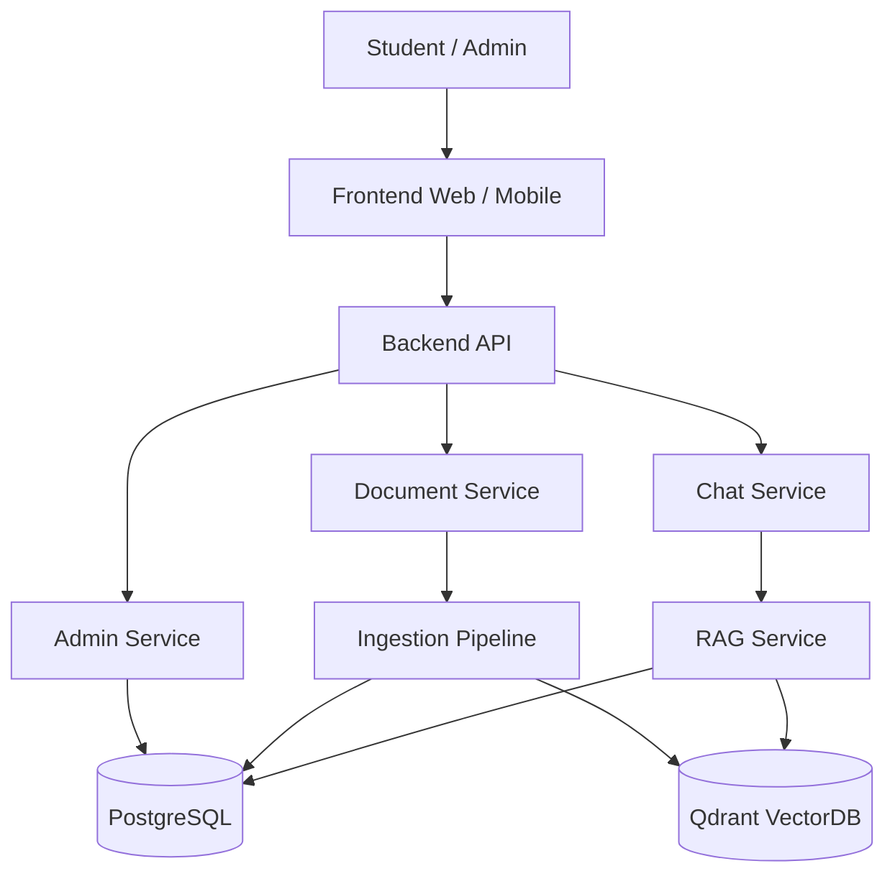
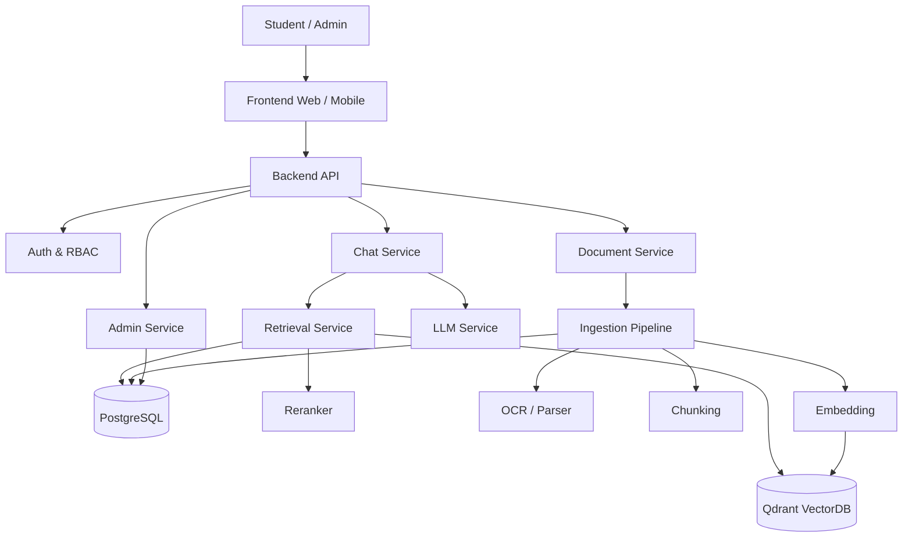
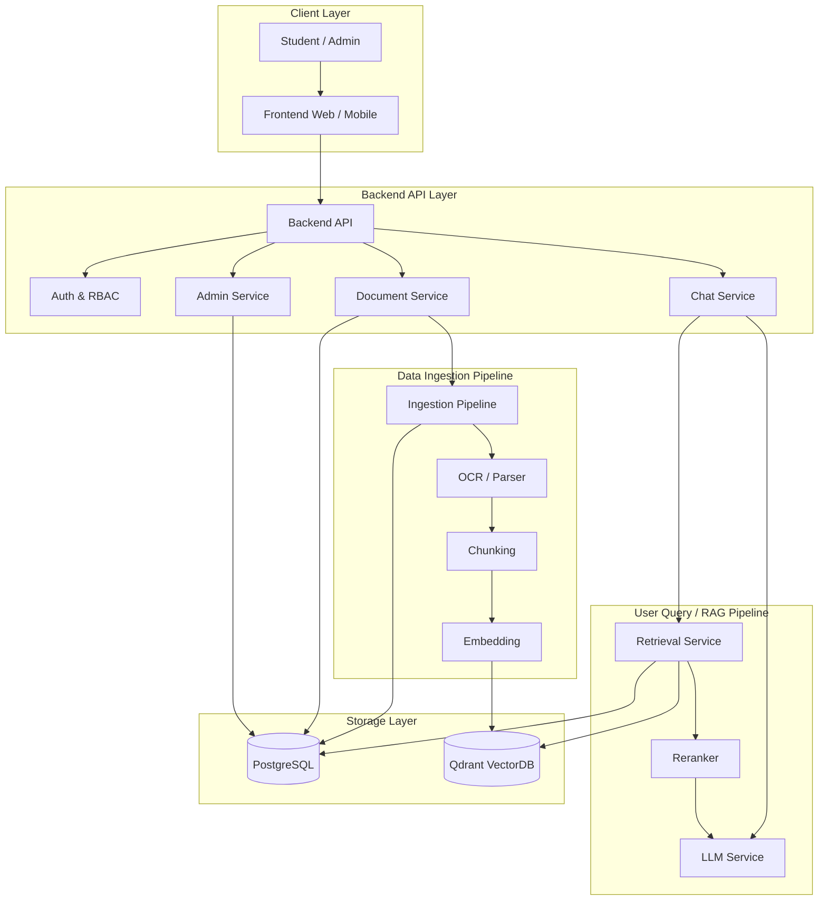

# Kiến trúc hệ thống - CTU Student Service RAG

File này mô tả kiến trúc tổng thể của hệ thống **CTU Student Service: Chatbot hỗ trợ sinh viên hoàn thành thủ tục hành chính dựa trên RAG**.

---

## 1. Mục tiêu kiến trúc

Hệ thống cần:

- Hỗ trợ sinh viên hỏi đáp thủ tục hành chính bằng ngôn ngữ tự nhiên.
- Truy xuất tài liệu CTU đã được duyệt.
- Trả lời có citation.
- Quản lý tài liệu, version, trạng thái hiệu lực.
- Hỗ trợ upload/cập nhật tài liệu cho admin.
- Có khả năng mở rộng thành AI Agent workflow.
- Có khả năng triển khai production-ready.

---

## 2. Kiến trúc tổng quát


---


---


---

## 3. Ba pipeline chính

```text
1. Data Ingestion Pipeline
   Xây dựng cơ sở tri thức.

2. User Query Pipeline
   Xử lý câu hỏi sinh viên.

3. Admin & Knowledge Management Pipeline
   Quản trị tài liệu, version, re-index, giám sát.
```

---

## 4. Thành phần hệ thống

| Thành phần | Vai trò |
|---|---|
| Frontend | Giao diện chatbot, upload hồ sơ, xem citation |
| Backend API | Điều phối nghiệp vụ, auth, chat, admin |
| PostgreSQL | Lưu dữ liệu có cấu trúc, metadata, version |
| Qdrant | Lưu vector chunks và payload filter |
| RAG Service | Retrieval, reranking, context building |
| LLM Service | Sinh câu trả lời grounded |
| OCR/Parser Service | Chuyển PDF/DOCX/Image sang Markdown |
| Admin Portal | Upload, review, publish, monitor |
| Obsidian Vault | Workspace để quản lý Markdown canonical |

---

## 5. Vai trò của Obsidian

Obsidian là:

```text
Knowledge Authoring & Review Workspace
```

Dùng để:

- Quản lý Markdown chuẩn.
- Chỉnh lỗi OCR.
- Gắn metadata YAML.
- Theo dõi trạng thái review/RAG.
- Quản lý version tài liệu.
- Ghi chú nghiên cứu và pipeline.

Obsidian không thay thế:

- PostgreSQL.
- Qdrant.
- Backend API.
- Admin Portal.
- Object Storage.

---

## 6. Cấu trúc vault đề xuất

```text
NLCS/
├── 00_Dashboard/
├── 01_Dataset/
├── 02_Attachments/
├── 03_Templates/
├── 04_RAG/
├── 05_Research/
├── 06_Processing/
└── 99_Archive/
```

Ý nghĩa:

| Thư mục | Vai trò |
|---|---|
| `00_Dashboard` | Theo dõi trạng thái dataset |
| `01_Dataset` | Markdown chính/canonical |
| `02_Attachments` | File gốc PDF/DOCX/Image |
| `03_Templates` | Template metadata và nội dung |
| `04_RAG` | File đã approved/published, chunk/log |
| `05_Research` | Ghi chú kiến trúc, OCR, đánh giá |
| `06_Processing` | OCR output, cleaning, need review |
| `99_Archive` | Tài liệu cũ/hết hiệu lực |

---

## 7. Backend modules đề xuất

```text
app/
├── modules/
│   ├── auth/
│   ├── users/
│   ├── documents/
│   ├── document_versions/
│   ├── ingestion/
│   ├── metadata/
│   ├── chunking/
│   ├── embeddings/
│   ├── vector_index/
│   ├── retrieval/
│   ├── reranking/
│   ├── chat/
│   ├── procedures/
│   ├── forms/
│   ├── admin/
│   └── monitoring/
```

| Module | Vai trò |
|---|---|
| `auth` | Đăng nhập, phân quyền |
| `documents` | Quản lý tài liệu |
| `document_versions` | Quản lý version |
| `ingestion` | Điều phối OCR → chunk → embed → index |
| `metadata` | Validate YAML/frontmatter |
| `chunking` | Chunk Markdown |
| `embeddings` | Gọi model embedding |
| `vector_index` | Upsert/update Qdrant |
| `retrieval` | Hybrid retrieval |
| `reranking` | Rerank kết quả |
| `chat` | Context building + LLM answer |
| `procedures` | Structured thủ tục |
| `forms` | Quản lý biểu mẫu |
| `admin` | API cho admin portal |
| `monitoring` | Log, metric, feedback |

---

## 8. PostgreSQL dùng để lưu gì?

PostgreSQL lưu dữ liệu có cấu trúc:

- Documents.
- Document versions.
- Metadata.
- Chunks metadata.
- Procedures.
- Forms.
- Departments.
- Users.
- Roles.
- Ingestion jobs.
- Feedback.
- Evaluation results.

---

## 9. Schema tối thiểu đề xuất

### 9.1. `documents`

```sql
CREATE TABLE documents (
    id UUID PRIMARY KEY,
    document_id TEXT UNIQUE NOT NULL,
    title TEXT NOT NULL,
    document_type TEXT NOT NULL,
    domain TEXT,
    department TEXT,
    created_at TIMESTAMP DEFAULT now(),
    updated_at TIMESTAMP DEFAULT now()
);
```

### 9.2. `document_versions`

```sql
CREATE TABLE document_versions (
    id UUID PRIMARY KEY,
    document_id TEXT NOT NULL,
    version_id TEXT UNIQUE NOT NULL,
    version TEXT,
    code TEXT,
    issued_date DATE,
    effective_date DATE,
    expiry_date DATE,
    is_latest BOOLEAN DEFAULT false,
    validity_status TEXT NOT NULL,
    review_status TEXT NOT NULL,
    rag_status TEXT NOT NULL,
    source_url TEXT,
    source_file TEXT,
    markdown_path TEXT,
    created_at TIMESTAMP DEFAULT now(),
    updated_at TIMESTAMP DEFAULT now()
);
```

### 9.3. `document_chunks`

```sql
CREATE TABLE document_chunks (
    id UUID PRIMARY KEY,
    chunk_id TEXT UNIQUE NOT NULL,
    document_id TEXT NOT NULL,
    version_id TEXT NOT NULL,
    heading_path TEXT,
    content TEXT NOT NULL,
    page_start INT,
    page_end INT,
    token_count INT,
    checksum TEXT,
    created_at TIMESTAMP DEFAULT now()
);
```

---

## 10. Qdrant dùng để lưu gì?

Qdrant lưu vector embedding của chunks.

Payload cần có:

```json
{
  "chunk_id": "",
  "document_id": "",
  "version_id": "",
  "title": "",
  "document_type": "",
  "domain": "",
  "department": "",
  "audience": ["student"],
  "version": "",
  "is_latest": true,
  "validity_status": "valid",
  "rag_status": "published",
  "confidentiality": "public",
  "page_start": 1,
  "page_end": 1,
  "source_url": "",
  "source_file": ""
}
```

Retriever mặc định filter:

```text
rag_status = published
validity_status = valid
confidentiality = public
```

Rule nghiêm ngặt:

```text
is_latest = true
```

---

## 11. User Query Pipeline

```mermaid
flowchart LR
    Q[User Question] --> PRE[Preprocess]
    PRE --> INT[Intent Classification]
    INT --> ENT[Entity Extraction]
    ENT --> MAP[Procedure Mapping]
    MAP --> RET[Hybrid Retrieval]
    RET --> RERANK[Reranker]
    RERANK --> CTX[Context Builder]
    CTX --> LLM[LLM Generation]
    LLM --> ANS[Answer with Citation]
```



Các bước:

1. Nhận câu hỏi hoặc file upload.
2. Tiền xử lý input.
3. Phân loại intent.
4. Trích xuất entity.
5. Mapping thủ tục.
6. Hybrid retrieval.
7. Metadata filter.
8. Reranking.
9. Context assembly.
10. LLM generation.
11. Trả lời có citation.

---

## 12. Retrieval strategy

Nên dùng hybrid retrieval:

```text
BM25 keyword search
+
Qdrant vector search
+
Metadata filtering
+
Reranker
```

Filter bắt buộc:

```text
rag_status = published
validity_status = valid
confidentiality = public
```

Filter tùy tình huống:

```text
document_type
domain
department
audience
procedure_code
effective_date
expiry_date
is_latest
```

---

## 13. Công nghệ đề xuất

| Layer | Gợi ý |
|---|---|
| Frontend | ReactJS hoặc Flutter |
| Backend | FastAPI hoặc NestJS |
| Database | PostgreSQL |
| Vector DB | Qdrant |
| Embedding | BAAI/bge-m3 |
| Reranker | bge-reranker |
| LLM | Qwen2.5, Llama 3, GPT-4o hoặc tương đương |
| Queue | Celery/RQ/BullMQ |
| Cache | Redis |
| Storage | Local/Object Storage/S3-compatible |
| Monitoring | Prometheus/Grafana/Sentry |

---

## 14. Admin workflow

```text
Admin upload tài liệu
  ↓
OCR / Parser
  ↓
Sinh Markdown
  ↓
Review trong Obsidian hoặc Admin Portal
  ↓
Metadata validation
  ↓
Approved + Valid + Published
  ↓
Chunking
  ↓
Embedding
  ↓
Index Qdrant
```

Khi tài liệu bị thay thế:

```text
Bản cũ:
validity_status = replaced
rag_status = deactivated
is_latest = false

Bản mới:
validity_status = valid
rag_status = published
is_latest = true
```

---

## 15. API gợi ý

| API | Mục đích |
|---|---|
| `POST /admin/documents/upload` | Upload tài liệu |
| `POST /admin/documents/{id}/ingest` | Chạy ingestion |
| `GET /admin/documents/{id}/status` | Xem trạng thái |
| `GET /admin/documents/{id}/chunks` | Xem chunks |
| `POST /admin/documents/{id}/publish` | Publish |
| `POST /admin/documents/{id}/deactivate` | Deactivate |
| `POST /chat` | Hỏi chatbot |
| `POST /chat/upload-check` | Kiểm tra hồ sơ upload |

---

## 16. Rủi ro kiến trúc và cách xử lý

| Rủi ro | Cách xử lý |
|---|---|
| Index nhầm tài liệu chưa duyệt | Backend validate trạng thái |
| Lẫn version cũ/mới | Dùng `document_id`, `version_id`, `is_latest` |
| Trả lời không có nguồn | Bắt buộc citation |
| Retrieval sai | Metadata filter + reranker |
| OCR sai | Review Markdown trước publish |
| Tài liệu hết hiệu lực | `validity_status`, `effective_date`, `expiry_date` |
| Khó debug | Log đầy đủ ingestion/retrieval/chunks |
| Tăng tải | Queue, cache, batch embedding |

---

## 17. Kết luận

Kiến trúc nên vận hành theo nguyên tắc:

```text
Markdown đã duyệt là nguồn RAG chính.
PostgreSQL quản lý metadata/version.
Qdrant quản lý vector chunks.
Retriever luôn filter theo trạng thái tài liệu.
LLM chỉ trả lời dựa trên context retrieved.
Câu trả lời phải có citation.
```
