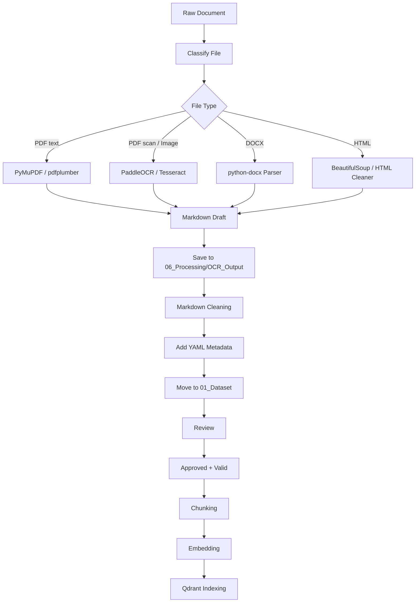

# OCR Pipeline - Chuẩn hóa tài liệu sang Markdown cho RAG

File này mô tả quy trình xử lý tài liệu từ **PDF/DOCX/Image** thành **Markdown chuẩn** để đưa vào RAG.

---

## 1. Mục tiêu

OCR Pipeline cần đảm bảo:

- Chuyển tài liệu gốc sang Markdown có cấu trúc.
- Giữ heading, bảng, chương, điều, khoản, danh sách.
- Có page marker để citation.
- Có YAML metadata để backend validate.
- Có trạng thái xử lý rõ ràng.
- Chỉ publish tài liệu đã OCR xong, review approved và còn hiệu lực.

---

## 2. Nguyên tắc cốt lõi

```text
PDF/DOCX/Image gốc = nguồn đối chiếu
OCR output = bản tạm
Markdown trong 01_Dataset = bản canonical
Qdrant chỉ nhận chunk từ Markdown đã approved + valid + published
```

Không dùng raw OCR text làm nguồn chính nếu Markdown đã được chuẩn hóa tốt hơn.

---

## 3. Luồng OCR tổng quát



---

## 4. Bước 1 - Nhận tài liệu gốc

Nguồn:

- PDF text.
- PDF scan.
- Ảnh scan.
- DOCX.
- Biểu mẫu.
- HTML/webpage.

Lưu file gốc vào:

```text
02_Attachments/
```

Ví dụ:

```text
02_Attachments/PDFs/PDT/QD1813_QD_ban_hanh_Quy_dinh_cong_tac_hoc_vu_2021.pdf
```

Checklist:

- [ ] File mở được.
- [ ] Có nguồn.
- [ ] Có ngày truy cập.
- [ ] Đặt đúng folder.
- [ ] Không chỉnh sửa file gốc.

---

## 5. Bước 2 - Phân loại file

| Loại file | Công cụ gợi ý | Output |
|---|---|---|
| PDF text | PyMuPDF, pdfplumber | Text + page mapping |
| PDF scan | PaddleOCR, Tesseract | OCR text + layout |
| Image | PaddleOCR | OCR text + layout |
| DOCX | python-docx | Paragraph/table/heading |
| HTML | BeautifulSoup | Clean Markdown |
| Table-heavy PDF | Camelot/Tabula/pdfplumber | Markdown table |

Metadata:

```yaml
file_type: "pdf"
parser: "pymupdf"
ocr_engine:
ocr_status: "processing"
```

---

## 6. Bước 3 - Trích xuất nội dung

### 6.1. PDF text

```text
PDF text
  ↓
Extract text by page
  ↓
Detect heading/list/table
  ↓
Generate Markdown draft
```

### 6.2. PDF scan / Image

```text
PDF scan / Image
  ↓
OCR
  ↓
Layout detection
  ↓
Table detection
  ↓
Generate Markdown draft
```

### 6.3. DOCX

```text
DOCX
  ↓
Read heading/paragraph/table
  ↓
Convert to Markdown
```

Output tạm:

```text
06_Processing/OCR_Output/<ten_file>_ocr.md
```

---

## 7. Bước 4 - Sinh Markdown draft

Markdown draft cần giữ:

- Tiêu đề.
- Chương.
- Điều.
- Khoản.
- Điểm.
- Bảng.
- Danh sách.
- Link biểu mẫu.
- Page marker.

Ví dụ:

```markdown
<!-- page: 1 -->

# Quy định công tác học vụ

## Chương I. Những quy định chung

### Điều 1. Phạm vi điều chỉnh

...

<!-- page: 2 -->

### Điều 2. Đối tượng áp dụng

...
```

---

## 8. Bước 5 - Làm sạch Markdown

Cần xử lý:

- Loại bỏ header/footer lặp lại.
- Loại bỏ trang trắng.
- Chuẩn hóa Unicode.
- Sửa lỗi OCR rõ ràng.
- Gộp dòng bị ngắt sai.
- Tách heading đúng cấp.
- Chuyển bảng thành Markdown table.
- Xóa khoảng trắng dư.
- Giữ page marker.

Không được:

- Không tự ý diễn giải lại quy định.
- Không tự đổi tên phòng ban.
- Không tự thêm thông tin.
- Không tự sửa ngày/số hiệu nếu không chắc.
- Không xóa nội dung gốc nếu chưa xác minh.

---

## 9. Bước 6 - Kiểm tra chất lượng OCR

Checklist:

- [ ] Không mất dấu tiếng Việt.
- [ ] Không lỗi font.
- [ ] Không thiếu trang.
- [ ] Không mất bảng.
- [ ] Không sai thứ tự cột.
- [ ] Không lặp header/footer.
- [ ] Heading đúng cấp.
- [ ] Có page marker.
- [ ] Nội dung đủ so với file gốc.

Nếu OCR lỗi:

```yaml
ocr_status: "need_review"
review_status: "need_fix"
rag_status: "not_indexed"
```

Nếu OCR thất bại:

```yaml
ocr_status: "failed"
rag_status: "not_indexed"
```

---

## 10. Bước 7 - Tạo Markdown chính trong `01_Dataset`

Sau khi làm sạch, tạo file canonical:

```text
01_Dataset/<Đơn vị hoặc Lĩnh vực>/<ten_tai_lieu>.md
```

Ví dụ:

```text
01_Dataset/PDT/QD1813_QuyDinhCongTacHocVu_2021.md
```

File này là nguồn chính để:

```text
review
metadata validation
chunking
embedding
Qdrant indexing
```

---

## 11. Bước 8 - YAML metadata chuẩn

Template tối thiểu:

```yaml
---
document_id: ""
version_id: ""
title: ""

document_type: ""
domain: ""
department: ""
audience:
  - "student"

code: ""
issued_date:
effective_date:
expiry_date:
version: ""

is_latest: false
validity_status: "unchecked"
replaces:
replaced_by:
supersession_note:

collection_status: "collected"
ocr_status: "done"
review_status: "not_reviewed"
rag_status: "not_indexed"

source_url: ""
source_file: ""
file_type: "pdf"
accessed_date:

language: "vi"
confidentiality: "public"
priority: "medium"
citation_type: "page"
chunking_strategy: "heading_based"

created_at:
updated_at:
checksum:
parser:
parser_version:
ocr_engine:
ocr_confidence:
notes:

tags:
  - ctu
---
```

---

## 12. Bước 9 - Kiểm tra hiệu lực và version

### Chưa xác định hiệu lực

```yaml
validity_status: "unchecked"
is_latest: false
rag_status: "not_indexed"
```

Không publish.

### Còn hiệu lực

```yaml
validity_status: "valid"
```

Có thể publish nếu đã approved.

### Bị thay thế

```yaml
validity_status: "replaced"
rag_status: "deactivated"
is_latest: false
replaced_by: "<version_id_moi>"
```

Không dùng cho chatbot mặc định.

---

## 13. Bước 10 - Review

Khi đang review:

```yaml
review_status: "reviewing"
```

Nếu cần sửa:

```yaml
review_status: "need_fix"
```

Nếu đã duyệt:

```yaml
review_status: "approved"
```

Checklist review:

- [ ] Nội dung đủ so với tài liệu gốc.
- [ ] Không mất dấu.
- [ ] Bảng đúng.
- [ ] Heading đúng.
- [ ] Metadata đủ.
- [ ] Hiệu lực đã kiểm tra.
- [ ] Page marker đúng.
- [ ] Không có thông tin nhạy cảm ngoài phạm vi công khai.

---

## 14. Bước 11 - Điều kiện publish vào RAG

Chỉ publish khi:

```yaml
ocr_status: "done"
review_status: "approved"
validity_status: "valid"
rag_status: "published"
confidentiality: "public"
```

Nếu dùng rule nghiêm ngặt:

```yaml
is_latest: true
```

Không publish nếu:

```text
validity_status = unchecked
validity_status = unknown
validity_status = expired
validity_status = replaced
review_status != approved
ocr_status != done
confidentiality != public
```

---

## 15. Bước 12 - Chunking từ Markdown

Chunk theo heading:

```text
# Tài liệu
## Chương
### Điều
#### Khoản
```

Với thủ tục:

```text
# Tên thủ tục
## Điều kiện
## Thành phần hồ sơ
## Quy trình thực hiện
## Nơi nộp
## Thời gian xử lý
```

Mỗi chunk cần có:

```json
{
  "document_id": "",
  "version_id": "",
  "heading_path": "",
  "page_start": 1,
  "page_end": 1,
  "content": ""
}
```

---

## 16. Bước 13 - Embedding

Nội dung embed nên gồm:

```text
Tài liệu: <title>
Đơn vị: <department>
Mục: <heading_path>

<chunk_content>
```

Model gợi ý:

```text
BAAI/bge-m3
```

Không embed file chưa đạt điều kiện RAG.

---

## 17. Bước 14 - Qdrant indexing

Payload:

```json
{
  "chunk_id": "",
  "document_id": "",
  "version_id": "",
  "title": "",
  "document_type": "",
  "domain": "",
  "department": "",
  "version": "",
  "is_latest": true,
  "validity_status": "valid",
  "rag_status": "published",
  "confidentiality": "public",
  "page_start": 1,
  "page_end": 1,
  "source_file": "",
  "source_url": ""
}
```

Retriever mặc định chỉ lấy:

```text
rag_status = published
validity_status = valid
confidentiality = public
```

---

## 18. Bảng quyết định nhanh

| Tình huống | Metadata | Có đưa vào RAG không? |
|---|---|---|
| Mới OCR | `review_status: "not_reviewed"` | Không |
| OCR lỗi | `ocr_status: "need_review"` | Không |
| Chưa kiểm tra hiệu lực | `validity_status: "unchecked"` | Không |
| Đã duyệt, còn hiệu lực | `approved` + `valid` | Có thể |
| Đã publish | `rag_status: "published"` | Có |
| Bị thay thế | `replaced` + `deactivated` | Không |
| Hết hạn | `expired` + `deactivated` | Không |

---

## 19. Lỗi thường gặp

### 19.1. Dùng `status` chung

Sai:

```yaml
status: "Đã thu thập"
```

Đúng:

```yaml
collection_status: "collected"
ocr_status: "done"
review_status: "approved"
rag_status: "published"
validity_status: "valid"
```

### 19.2. Publish tài liệu chưa kiểm tra hiệu lực

Sai:

```yaml
validity_status: "unchecked"
rag_status: "published"
```

Đúng:

```yaml
validity_status: "unchecked"
rag_status: "not_indexed"
```

### 19.3. Tài liệu bị thay thế nhưng vẫn active

Sai:

```yaml
validity_status: "replaced"
rag_status: "published"
```

Đúng:

```yaml
validity_status: "replaced"
rag_status: "deactivated"
```

---

## 20. Dataview kiểm tra nhanh

### Tài liệu OCR xong nhưng chưa review

```dataview
TABLE document_id, version_id, title, ocr_status, review_status
FROM "01_Dataset"
WHERE ocr_status = "done" AND review_status != "approved"
SORT updated_at DESC
```

### Tài liệu chưa kiểm tra hiệu lực

```dataview
TABLE document_id, version_id, title, validity_status, rag_status
FROM "01_Dataset"
WHERE validity_status = "unchecked" OR validity_status = "unknown"
SORT updated_at DESC
```

### Tài liệu bị thay thế nhưng chưa deactivate

```dataview
TABLE document_id, version_id, title, validity_status, rag_status, replaced_by
FROM "01_Dataset"
WHERE validity_status = "replaced" AND rag_status != "deactivated"
SORT updated_at DESC
```

---

## 21. Kết luận

OCR Pipeline đúng là:

```text
File gốc
  ↓
OCR / Parser
  ↓
Markdown draft
  ↓
Markdown cleaning
  ↓
Canonical Markdown trong 01_Dataset
  ↓
Metadata + Review + Validity
  ↓
Published
  ↓
Chunking
  ↓
Embedding
  ↓
Qdrant
```

Quy tắc nhớ nhanh:

```text
Unchecked thì không publish.
Replaced thì deactivated.
Approved + Valid mới được Published.
Markdown trong 01_Dataset là nguồn RAG chính.
```
