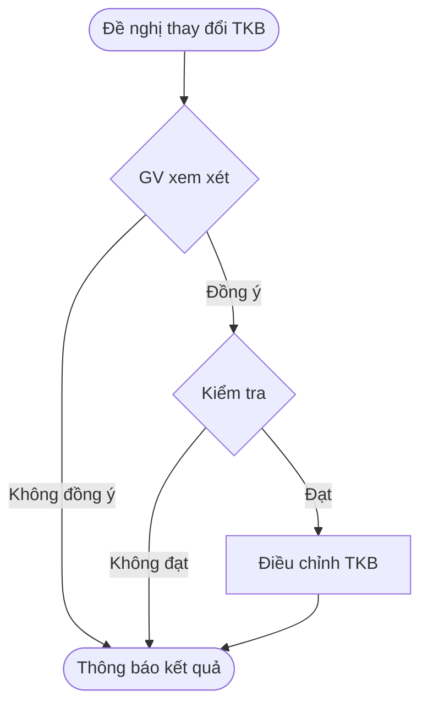

1

<!-- page: 1 -->

# QUY TRÌNH

# ĐỀ NGHỊ THAY ĐỔI THỜI KHÓA BIỂU LỚP HỌC PHẦN

## I. QUY TRÌNH CÔNG TÁC:

### 1. Cơ sở thực hiện:

Quy trình này thực hiện sau khi trường công bố danh sách lớp mở học phần và trước khi sinh viên đăng ký học phần học kỳ.

**Mục đích, phạm vi áp dụng:**

Nhóm sinh viên có yêu cầu do bị trùng thời khóa biểu hai hay nhiều lớp học phần.

**Yêu cầu và các văn bản quy định:**

- Có sự đồng ý của giảng viên.
- Lớp học phần chưa có sinh viên đăng ký.
- Quy định về công tác học vụ đang áp dụng.

**Giải thích từ ngữ, từ viết tắt.**

- SV : Sinh viên
- GV : Giảng viên
- PĐT : Phòng Đào tạo
- BM : Bộ môn
- TKB : Thời khóa biểu

### 2. Nội dung quy trình:

- Đại diện SV làm đơn theo mẫu (Mẫu 1) cho GV.
- GV phụ trách lớp học phần.
- Phòng Đào tạo tiếp nhận đơn và xem xét các yêu cầu.
- Điều chỉnh TKB.
- Phòng Đào tạo thông báo kết quả trực tiếp cho SV.

---

2

<!-- page: 2 -->

## II. LƯU ĐỒ:

| Quy trình đề nghị thay đổi thời khóa biểu lớp học phần / Bước | Quy trình đề nghị thay đổi thời khóa biểu lớp học phần / Lưu đồ | Quy trình đề nghị thay đổi thời khóa biểu lớp học phần / Nội dung công việc | Quy trình đề nghị thay đổi thời khóa biểu lớp học phần / Người thực hiện | Quy trình đề nghị thay đổi thời khóa biểu lớp học phần / Thời gian thực hiện | Quy trình đề nghị thay đổi thời khóa biểu lớp học phần / Ghi chú |
| --------------------------------------------------------------------------- | ------------------------------------------------------------------------------ | ------------------------------------------------------------------------------------------ | ---------------------------------------------------------------------------------------- | ------------------------------------------------------------------------------------------- | ----------------------------------------------------------------------------- |
| 1                                                                           | Đề nghị thay đổi TKB                                                      | Gửi đơn đề nghị cho GV                                                               | Sinh viên                                                                               | 1 tuần                                                                                     | Mẫu 1                                                                        |
| 2                                                                           | GV xem xét                                                                    | Xem xét yêu cầu và ghi ý kiến xác nhận cho PĐT                                    | GV                                                                                       | 2 ngày làm việc                                                                          |                                                                               |
| 3                                                                           | Kiểm tra                                                                      | Nhận đơn và kiểm tra các điều kiện                                                | PĐT                                                                                     | 1 buổi làm việc                                                                          |                                                                               |
| 4                                                                           | Điều chỉnh TKB                                                              | Điều chỉnh TKB                                                                          | PĐT                                                                                     | 1 buổi làm việc                                                                          |                                                                               |
| 5                                                                           | Thông báo kết quả                                                          | Thông báo kết quả cho SV                                                               | GV, PĐT                                                                                 |                                                                                             |                                                                               |

---

3

<!-- page: 3 -->

**CỘNG HÒA XÃ HỘI CHỦ NGHĨA VIỆT NAM**
**<u>Độc lập – Tự do – Hạnh phúc</u>**

# ĐƠN ĐỀ NGHỊ THAY ĐỔI THỜI KHÓA BIỂU LỚP HỌC PHẦN

Kính gửi:

- Phòng Đào tạo;
- Bộ môn quản lý học phần;
- Giảng viên giảng dạy lớp học phần.

* Tôi tên:      MSSV:
* Là sinh viên ngành:      Khóa:      ,
* Thuộc Khoa (Viện/Bộ môn):
* Đại diện cho những sinh viên đã lập kế hoạch học tập kính đề nghị được thay đổi thời khóa biểu lớp học phần      học kỳ      năm học 20     - 20
* Lý do:

Thời khóa biểu lớp học phần đề nghị được thay đổi cụ thể như sau:

| Tên học phần | Mã số học phần | Ký hiệu | Họ và tên giảng viên | Trước thay đổi / Thứ | Trước thay đổi / Tiết | Sau thay đổi / Thứ | Sau thay đổi / Tiết |
| --------------- | ------------------ | --------- | ------------------------- | ------------------------- | -------------------------- | --------------------- | ---------------------- |

Trân trọng kính chào./.

Cần Thơ, ngày      tháng      năm 20...

**Đại diện nhóm sinh viên**

**Ý kiến của Giảng viên lớp học phần**
